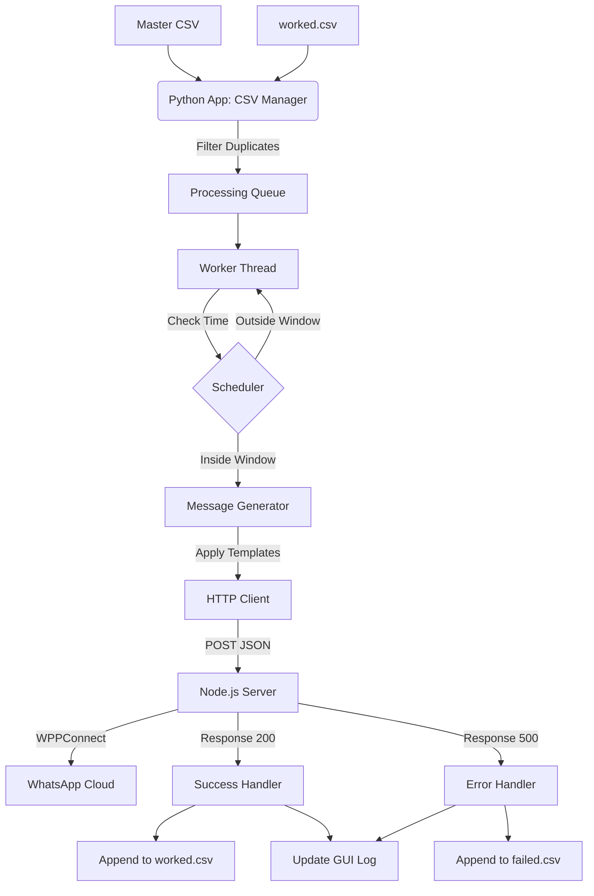

## **A. System Overview**

**Project Name:** Local WhatsApp Automation Suite (L-WAS)

**Description:**
L-WAS is a desktop automation solution designed to send personalized WhatsApp messages to a list of contacts. It operates on a decoupled architecture:
1.  **Python Frontend (Client):** Handles the Graphical User Interface (GUI), business logic, scheduling, CSV processing, and state management.
2.  **Node.js Backend (Server):** A lightweight bridge server using `wppconnect` to interface with the WhatsApp Web protocol. It exposes a local REST API.

**Architecture:**
*   **Communication:** The Python app sends HTTP POST requests to the Node.js server (`localhost:3000`).
*   **Data Persistence:** The app maintains state via local CSV files (`worked.csv`, `failed.csv`) and a JSON configuration file (`state.json`).
*   **Execution:** The Python app runs a background worker thread that keeps the UI responsive while processing the message queue and adhering to time schedules.

---

## **B. Functional Requirements**

### **1. Scheduling & Time Management**
*   **Days of Week:** User can select specific active days (e.g., Mon, Tue, Wed).
*   **Time Windows:** User defines start and end times (e.g., `09:00` to `17:00`).
*   **Logic:** The worker thread checks the system time every second. If the current time/day is outside the allowed window, the worker pauses (enters a "Waiting for schedule" state) until the window opens.

### **2. CSV Processing & "worked.csv" Logic**
*   **Master Input:** A CSV file containing: `name`, `phone`, `username_type`.
*   **Persistence Strategy (The "Worked" Logic):**
    *   **Startup/Load:** When the process starts, the app reads `worked.csv` (a registry of previously successful numbers).
    *   **Filtering:** It compares the Master Input against `worked.csv`. Any phone number found in `worked.csv` is **skipped**.
    *   **Queue:** Only numbers *not* present in `worked.csv` are added to the processing queue.
    *   **Runtime:** As soon as a message is successfully sent, that record is immediately appended to `worked.csv` to prevent duplicate sends if the app is restarted.

### **3. Message Templates**
*   **Dynamic Selection:** The app selects the template based on the `username_type` column in the CSV (values: `male`, `female`, `group`).
*   **Placeholders:** Support for `{name}`, `{phone}`, and `{username_type}` replacement within the text.

### **4. Rate Limiting & Delays**
*   **Configuration:** User sets "Messages per minute".
*   **Calculation:** `Delay = 60 seconds / Messages_per_minute`.
*   **Jitter:** (Optional but recommended) Slight random variation to emulate human behavior.

### **5. Logging & Error Handling**
*   **Success:** Log to GUI console and append to `worked.csv`.
*   **Logical Failure:** (e.g., Network error, Node server down) Append to `failed.csv`.
*   **System Error:** (e.g., Python exceptions) Append to `errors.txt`.
*   **Retry Logic:** If the Node server returns a 500 or times out, retry X times before marking as failed.

### **6. Communication with Node.js**
*   **Endpoint:** `POST http://localhost:3000/send-message`
*   **Payload:** `{"number": "123456789", "message": "Hello..."}`
*   **Note on Formatting:** The provided Node.js `index.js` appends `@c.us`. The Python app must send the **raw number** (digits only).

### **7. CustomTkinter GUI**
*   **Tabs:**
    1.  **Dashboard/Run:** Load CSV, Start/Stop/Pause controls, Progress Bar, Live Console.
    2.  **Settings:** Schedule config, Rate limits, Phone number for "Done" notification.
    3.  **Templates:** Text areas for Male, Female, and Fallback/Group messages.
    4.  **Data:** Preview tables for CSVs, buttons to open log files.

---

## **D. Data Flow Diagram**



---

## **E. Flowchart (Execution Loop)**

```text
[START]
   |
   v
[Load Configuration & Templates]
   |
[Load Master CSV] <---+
   |                  |
[Load worked.csv]     |
   |                  |
[Filter: Queue = Master - Worked]
   |
   v
[User Clicks START]
   |
   v
[Loop: While Queue is not Empty]
   |
   +-> [Check Pause State?] --(Yes)--> [Sleep 1s] -> [Loop]
   |
   +-> [Check Schedule?] --(No)--> [Update Status: Waiting] -> [Sleep 30s] -> [Loop]
   |
   +-> (Yes - Schedule OK)
   |
   v
[Pop Next Contact]
   |
[Select Template (Male/Female)]
   |
[Format Message (Replace {name})]
   |
[POST /send-message to Node.js]
   |
   +-> (Success?) --(Yes)--> [Log to worked.csv] -> [GUI Success Log] -> [Sleep Rate Limit]
   |
   +-> (No) ------> [Log to failed.csv] -> [GUI Error Log]
   |
   v
[Loop]
   |
[Queue Empty?] --(Yes)--> [Send 'Done' Msg] -> [STOP]
```

---

## **F. Directory Structure**

```text
WhatsAppAutomation/
│
├── node_server/
│   ├── index.js          # (Provided file)
│   ├── package.json
│   └── node_modules/
│
├── src/
│   ├── __init__.py
│   ├── main.py           # Entry point
│   ├── gui.py            # CustomTkinter Interface
│   ├── worker.py         # Threading & Logic
│   ├── scheduler.py      # Time checking logic
│   ├── csv_manager.py    # Data loading & Filtering
│   ├── node_client.py    # HTTP Requests
│   ├── utils.py          # Helpers (Text formatting)
│   └── assets/           # Icons (optional)
│
├── data/
│   ├── input.csv         # User provided list
│   ├── worked.csv        # Auto-generated
│   ├── failed.csv        # Auto-generated
│   └── errors.txt        # Auto-generated
│
├── state.json            # Saves GUI settings
├── requirements.txt      # Python dependencies
└── README.md
```

---
