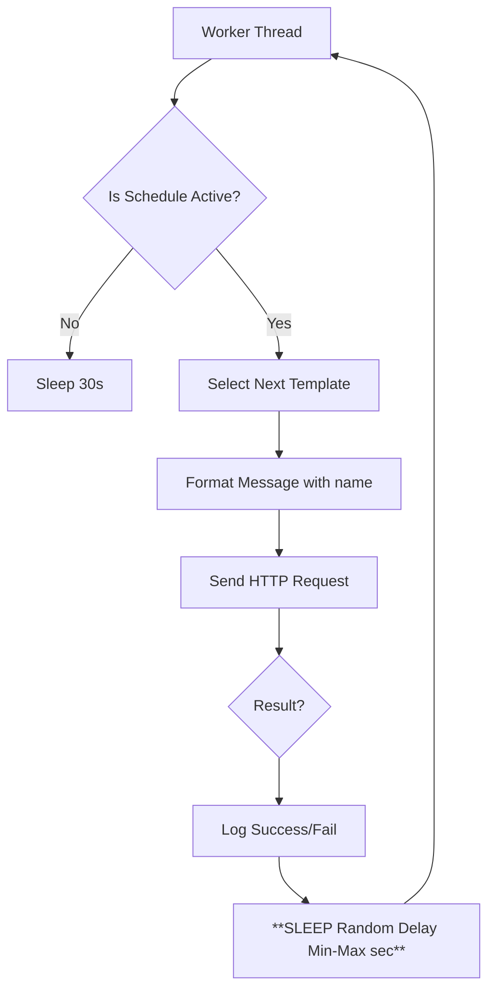

## **A. System Overview**

**Project Name:** Local WhatsApp Automation Suite (L-WAS) v2.2

**Description:**
L-WAS v2.2 is a desktop automation solution for sending personalized WhatsApp messages. This version features a **Multi-Session Scheduler**, **Random Delay Range Control**, **Simplified CSV Input** (name & phone only), and **3 Rotating Message Templates** for natural message variation.

**Architecture:**
*   **Frontend:** Python/CustomTkinter.
*   **Backend:** Node.js `wppconnect` bridge.
*   **Timing:**
    *   **Scheduler:** Determines *if* the worker is allowed to run based on Time of Day.
    *   **Rate Controller:** Generates random pause durations between messages (e.g., "Sleep 3-7 seconds").

---

## **B. Functional Requirements (Updated)**

### **1. Scheduling (Multi-Session)**
*   (Unchanged) Users define multiple active windows per day (e.g., Mon 09:00-12:00 AND 14:00-16:00).

### **2. Rate Limiting (NEW: Random Delay Range)**
*   **Input:** Two fields - "Delay Min (sec)" and "Delay Max (sec)".
*   **Data Type:** Positive numbers (Integer or Float). Examples: Min=`3`, Max=`7`.
*   **Logic:**
    1.  Worker sends a message.
    2.  Worker receives response (Success/Fail).
    3.  Worker generates a **random delay** between Min and Max seconds.
    4.  Worker **sleeps** for the randomly generated duration.
    5.  Worker proceeds to the next contact.
*   **Constraint:** Both inputs must be $> 0$, and Min must be $\leq$ Max.
*   **Purpose:** Random delays create more natural-looking behavior and reduce spam detection risk.
*   **Interaction with Retries:** If a network error occurs, internal retries happen *within* the send attempt. The random delay occurs *after* the final outcome of that attempt is resolved.

### **3. CSV Processing & Logging (UPDATED)**
*   **Input CSV Format:** Must contain exactly 2 columns: `name`, `phone`
*   **Removed:** `username_type`/`gender` column - no longer required or processed
*   **Processing:** Load CSV -> Filter against `worked.csv` -> Log results
*   **Worked Log:** Stores `name`, `phone`, `timestamp`
*   **Failed Log:** Stores `name`, `phone`, `reason`, `timestamp`

### **4. Message Templates (NEW)**
*   **Number of Templates:** 3 distinct templates (Template 1, Template 2, Template 3)
*   **Rotation Logic:** Messages are sent using templates in rotating order (1→2→3→1→2→3...)
*   **Variable Support:** Each template supports `{name}` variable for personalization
*   **Example:** "Hello {name}, welcome to our service!" → "Hello Ahmed, welcome to our service!"
*   **Purpose:** Rotating templates create message variety and reduce spam detection patterns

### **5. GUI Dashboard (Updated)**
*   **Global Settings Area:**
    *   **Removed:** "Message Delay (seconds)" (single value)
    *   **Added:** "Delay Min (sec)" and "Delay Max (sec)" inputs
*   **Templates Tab:**
    *   **Removed:** Male/Female/Group templates
    *   **Added:** Template 1, Template 2, Template 3 text areas
    *   **Variable Info:** Shows supported variable: `{name}`
*   **Validation:** Prevent non-numeric input, negative numbers, and ensure Min ≤ Max

---

## **D. Data Flow Diagram (Updated)**



---

## **E. Flowchart (Worker Execution)**

```text
[START WORKER]
   |
   v
[Load Queue]
   |
   v
[LOOP: While Queue Not Empty]
   |
   +-> [Check Pause/Stop?]
   |
   +-> [Check Schedule (Multi-Session)?] --(No)--> [Wait]
   |
   +-> (Yes)
   |
   v
[Pop Contact] -> [Rotate Template] -> [Format with {name}] -> [POST to Node.js]
   |
   v
[Receive Response]
   |
   +-> (Success) -> [Log worked.csv (name, phone, timestamp)]
   +-> (Fail)    -> [Log failed.csv (name, phone, reason, timestamp)]
   |
   v
[**SLEEP: Random Delay (between Min-Max seconds)**]  <-- UPDATED STEP
   |
   v
[Loop]
```

---

## **F. Sequence Diagram (Timing)**

1.  **Worker** selects next template (rotating through 1→2→3).
2.  **Worker** formats template with contact's `{name}`.
3.  **Worker** calls `NodeClient.send_message()`.
4.  **NodeClient** returns `200 OK`.
5.  **Worker** updates GUI Progress.
6.  **Worker** generates random delay between `delay_min` and `delay_max`.
7.  **Worker** executes `time.sleep(random_delay)` and logs the delay duration.
8.  **Worker** begins next iteration.

---

## **H. README Update (Configuration)**

### **Global Settings**
*   **Delay Min (sec):** Minimum random delay in seconds between messages.
    *   *Recommended:* `3` to `5` seconds.
*   **Delay Max (sec):** Maximum random delay in seconds between messages.
    *   *Recommended:* `7` to `15` seconds to avoid spam detection.
*   **Purpose:** Random delays between Min and Max create natural timing patterns.
*   **Done Number:** Phone number to receive a notification when the batch finishes.

### **Input CSV Format**
*   **Required Columns:** `name`, `phone` (case-insensitive)
*   **Removed:** No longer requires or processes `username_type` or `gender` column
*   **Example:**
    ```csv
    name,phone
    Ahmed,+201234567890
    Sara,+201098765432
    ```

### **Message Templates**
*   **Setup:** Define 3 different message templates in the Templates tab
*   **Variables:** Use `{name}` to personalize messages
*   **Behavior:** System automatically rotates through templates (1→2→3→1...)
*   **Example Templates:**
    *   Template 1: "Hi {name}, I hope this message finds you well!"
    *   Template 2: "Hello {name}, just wanted to reach out to you."
    *   Template 3: "Hey {name}, hope you're doing great!"